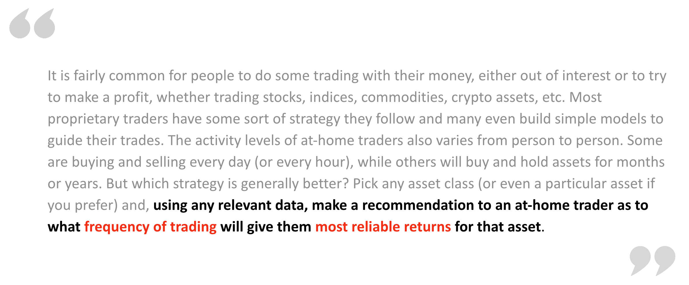
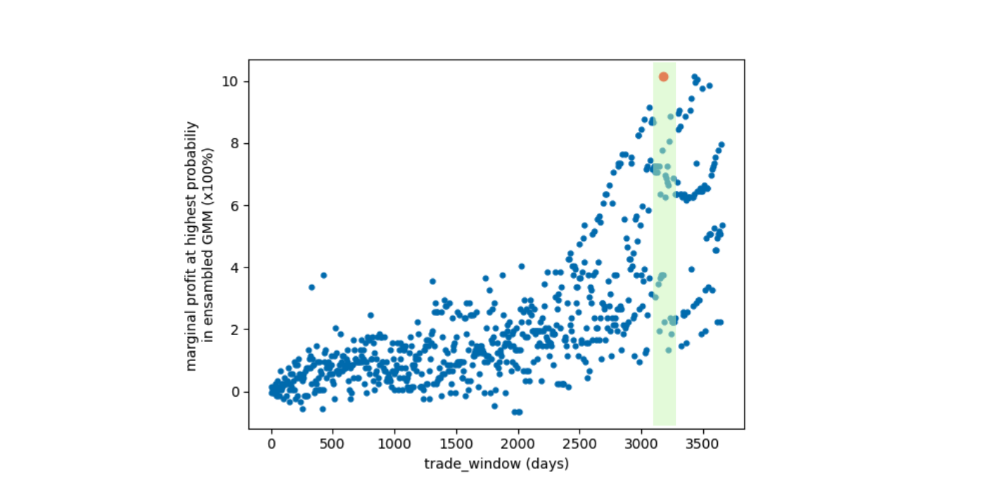

## Optimizing Trading Frequency
### Problem Overview

### Approach
#### Dataset
https://www.kaggle.com/datasets/paultimothymooney/stock-market-data

Place data under directory ```./data/stock_market_data/```
#### Assumptions
1. Optimal trading frequency is based on historical record from 1999-2022 purely. That means no other features or attributes are taken into the consideration
2. We assume no inflation rate in our base model. This is a simplificiaton, because theoratically a marginal profit of 10% tomorrow is different from a margianl profit of 10% in 10 years. We will discuss the next step to put inflation rate into consideration in future work
3. Recommandation is provided for universal traders. That means not to a specific stock buyer
4. Minimum frequency is one day
5. Each trading event is i.i.d

#### Thinking Process
A typical application to the stock market dataset is to do time series forecasting based on historical record. While it is possible to use ML models like ARIMA and RNN to predict a time window of stock price to further make a suggestion on trade frequency, stock market is highly unpredictable, and seasonality analysis is usually insufficient. We take a completely different  path to solve this problem. 


First of all, suppose a trader buys a stock at time $T_1$ at the price $P_1$, and a trade window is $\Delta T$, the trader sells the stock at time $T_1+\Delta T$ at the price $P_2$. The marginal profit (without considering tax, transaction fee or inflation) is therefore $(P_2-P_1)/P_1$. The problem can then be formulated as $argmax_{\Delta T}(P_2-P_1)/P_1$, given **any** $P_1$ and $T_1$. If we think of same day trading, an array of "close price" of a stock - its corresponding array of "open price" will be a perfect simplified representation (see first figure). Similarly, we can "dynamically warp" the operation to get N day trading results for that specific stock. 

Since traders can trade at any time $T_1$, we need to **model the distribution of marginal profit**, and find the $\Delta T$ that has highest probability of giving most marginal profit.


### Distribution Modelling
Histograms of marginal profits of 10 randomly selected stock profile generated from N days trading frequency.


Here are examples of the marginal profit distribution for a specific stock. 

|                     nasdaq/AAL                     |                     sp500/HQ                     |
| :------------------------------------------------: | :----------------------------------------------: |
|  |  |

We can see clearly that with different size of $\Delta T$, the distribution of our marginal profit also gets changed. This is understandable because if we only do same day trading, we would not expect the stock price to change too much on average, making the standard deviation of the distribution small. On the other hand, if we increase the size of $\Delta T$, we will expect a significant raise or drop in the stock price. 

To model this, one of the best options is Gaussian Mixture Models (GMM) that use Expectation-Maximization to find maximum likelihood estimates to fit n Gaussian models. Another reason for me to choose GMM is because we will be fitting GMM on a range of $\Delta T$ for each stock profile, then ensamble all the GMMs to get a weighted average distribution for each $\Delta T$. GMM is very light-weighted (3n parameters, weights, means, covs) and fast, this approach would not be possible otherwise. 


### Hyperparameter Tuning
To make this process automated, we use $argmin_nAIC$ (Akaike information criterion). Therefore no cross-validation is required (only have one hyperparameter). We split the train:test ratio as 8:2.

### Setup
* Run in a virtual env with python version 3.7.16. ```pip install -r requirements.txt```
* Alternatively, you may create a Container using ``` Dockerfile ```

#### Training
All the settings related to training are put under ```configs.yaml```. To train, run 
```python train.py ```


### Results
At the end, we take the $\Delta T=3164$ days which has highest probability of largest  profit. This is actually as expected, because most of the time we will have the stock much higher than its starting price after several years. However, we did not consider inflation rate here, so the actual marginal profit when $\Delta T >= 365$ days is smaller than current model reported. To integrate this change, we can make adjustment as $M \leftarrow M/(1+I(t))^{\Delta T}$.


Another thing to note is that we are essentially comparing marginal profit from a same day trading frequency to a 10 year trading frequency, which might not be a fair comparision (depending on the objective). To make a fair comparision is very easy. As we treat every trade event as i.i.d., we can just scale the N day trading marginal profit by a constant value $\Delta T$, so that we are now comparing **marginal profit per day**. Implementation is also simple, we do not need to retrain our GMMs, a constant scale to all random variables will just make $\mu \leftarrow \Delta T\mu$, and $\sigma^2 \leftarrow \Delta T^2\sigma^2$. 

### Software Product
We can push this project further to make an end-to-end software product to provide real-time recommandation. New stock profile gets updated and stored in the database, and our GMM models evaluate the performance on new data using metrics, AIC and BIC. If the error terms exceeds a certain threshold, it will trigger a training request to update the models in the database. 

On the user side, they could send request based on their interest. If they want to know about a set of specific stocks, our proposed GMM enambles will only be weighted averaging over those stocks. On the other hand, if they are asking general inquiry, we can just preload the recommandation. 


